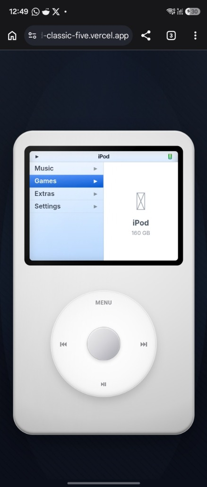
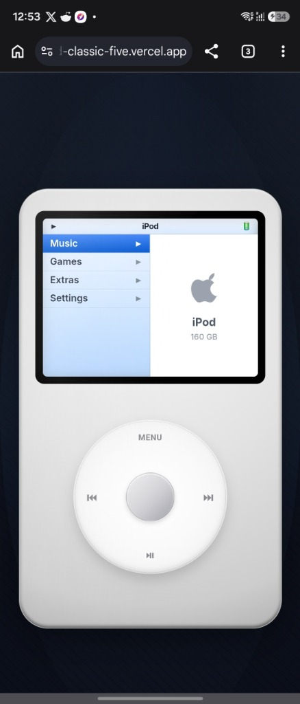

# 📱 iPod Classic Web App

> A premium, high-fidelity, interactive browser-based replica of the legendary iPod Classic. Built entirely with vanilla HTML, CSS, and JavaScript.

This web application brings back the nostalgia of the original iPod Classic, complete with a realistic **brushed metal finish**, **chrome accents**, a **fully functional Touch Click Wheel** with circular scroll gestures, **retro games**, and **immersive click/haptic sound effects** powered by the Web Audio API.

---

## 📸 Screenshots

Here is the iPod Classic in both its classic **Silver Metal** and modern **Anodized Dark Gray** editions:

<p align="center">
  
  &nbsp;&nbsp;&nbsp;&nbsp;
  
</p>

*The interface automatically aligns with your device's system appearance (Light / Dark mode) to deliver a perfectly tailored premium experience.*

---

## ✨ Features

- **Brushed Metal Design System**: Layered HSL gradients and radial chrome styling that creates a tactile, physical look.
- **Realistic Click Wheel**: 
  - **Rotary Gestures**: Move your cursor or finger in a circular motion around the wheel to scroll smoothly through menus—just like the physical scroll wheel!
  - **Audio Click Feedback**: Synthetic click sounds generated dynamically via the **Web Audio API** trigger as you scroll past menu items.
  - **Tactile Click Feedback**: Integrated with the browser's Haptic Vibration API for supported mobile devices on button press and scroll ticks.
- **Classic Games Library**:
  - 🎮 **Brick**: The iconic Breakout brick-breaker arcade classic.
  - 🪂 **Parachute**: Pilot and rescue landing parachutists while dodging helicopter blades.
  - 🎵 **Music Quiz**: Test your musical knowledge with a fast-paced game that pulls random tracks and tests your memory.
- **Full Screen / Mobile Optimization**: Automatically fills the screen on mobile devices (e.g., iPhone/Android Safari & Chrome) for a native app feel.
- **Music & Settings UI**: Includes settings, a fully working menu navigation hierarchy, back button mappings, and customizable system options.

---

## 🕹️ Controls & Navigation

You can interact with the iPod Classic exactly like you would with the physical hardware:

### Using the Touch Click Wheel
- **Scroll (Rotate)**: Click/touch and drag your mouse/finger in a **circular motion** clockwise (to scroll down) or counter-clockwise (to scroll up) within the grey wheel.
- **Center Select Button**: Press the solid center button to enter menu folders, start games, select songs, or confirm actions.
- **MENU Button (Top)**: Goes back to the parent folder or previous menu screen.
- **Play/Pause Button (Bottom)**: Play, pause, or suspend current music or game.
- **Previous / Next Buttons (Left / Right)**: Skip tracks, control game elements, or change adjustable sliders.

---

## 🚀 Quick Start / How to Run

Since the application is built entirely using vanilla front-end technologies (no complex build steps, bundling, or npm installations needed), you can run it immediately!

### Option 1: Open Directly in Browser
Double-click the [index.html](index.html) file to open the app instantly in any modern web browser.

### Option 2: Run a Local Static Web Server
If you'd like to host it locally (recommended for full responsive layouts and modern API integrations):

Using **Python**:
```bash
python3 -m http.server 8000
```
Then open `http://localhost:8000` in your browser.

Using **NodeJS** (`http-server` or `live-server`):
```bash
npx http-server -p 8000
```

---

## 📂 Project Architecture

```
iPod/
├── index.html        # Main frame layout, SVG icons & structural viewport
├── styles.css        # Brushed metal layers, glossy reflection mask, click wheel aesthetics
├── assets/           # Light & Dark mode screenshots for README documentation
└── src/
    ├── app.js        # Device bootstrapping, responsive scaling, haptics & key bindings
    ├── audio.js      # Web Audio API physical speaker sound generator
    ├── clickwheel.js # Angular math coordinates calculator for rotary touch tracking
    ├── menu.js       # Dynamic multi-level UI menu controller & options database
    └── games/        # Retro games engines:
        ├── brick.js      # Breakout / Brick arcade game
        ├── parachute.js  # Parachute retro helicopter rescue game
        └── musicquiz.js  # Music trivia dynamic audio game
```

---

## 🛠️ Technical Implementation Highlights

1. **Rotary Tracking Algorithm** (`clickwheel.js`):
   Utilizes trigonometry ($\arctan2$) to compute angles of touch/mouse movement relative to the center of the wheel. Tracks transitions across $360^{\circ}$ borders to emit seamless scroll ticks.
2. **Dynamic Audio Synthesis** (`audio.js`):
   Instantiates an `AudioContext` on user interaction and uses native oscillators and high-pass filters to dynamically build low-latency mechanical tick sounds, avoiding bulky asset files and ensuring instantaneous responses.
3. **Pure Responsive Aspect Ratio Lock** (`styles.css`):
   Employs modern CSS grid systems, viewport units, and container dimensions to guarantee the iPod mimics the identical 3:4 screen ratio and scale factors, eliminating background clutter on mobile.

---

*Enjoy the ultimate retro throwback experience! Made with 🎧 by biswatma.*
